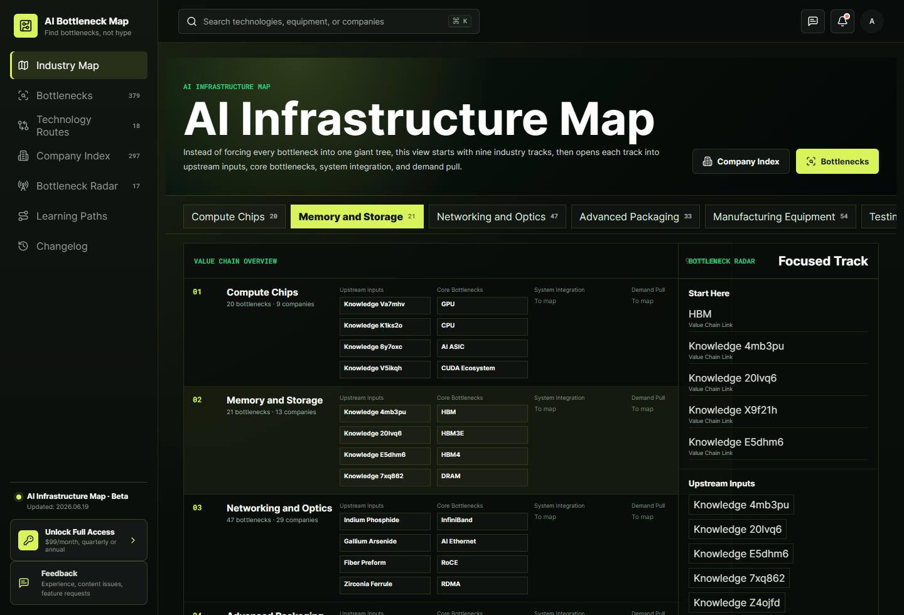
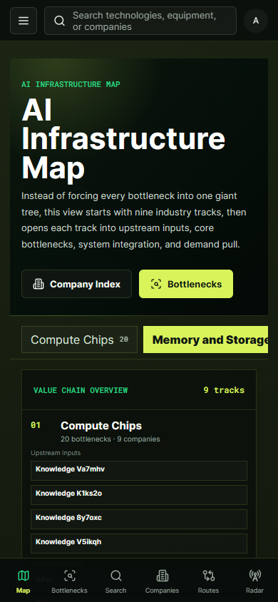
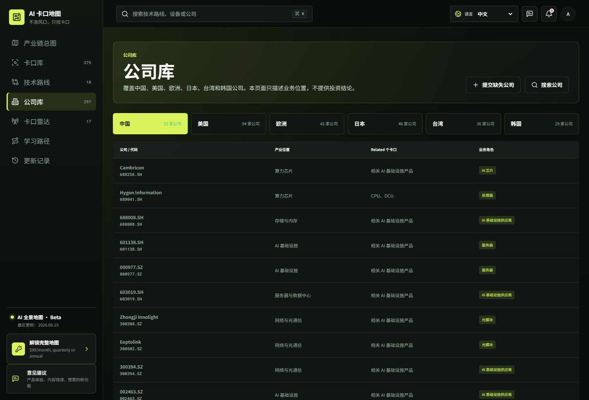
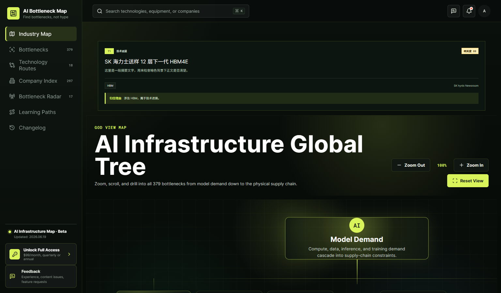

# AICARDMAP

AICARDMAP 是一个面向 AI 硬件基础设施的产业链情报地图。

它不追风口，而是追踪 AI 硬件产业链里真正变紧、变贵、变重要的环节。

官网：[https://aicardmap.com](https://aicardmap.com)

联系邮箱：[yuanqitanchang@163.com](mailto:yuanqitanchang@163.com)

## 这个产品解决什么问题

AI 硬件产业链很长，信息分散在公司公告、行业报告、供应链新闻、技术路线和客户关系里。AICARDMAP 试图把这些零散信息整理成一张可以查询的地图，让用户先看到产业链全局，再进入具体环节和公司。

## 核心功能

- 按产业链环节理解 AI 硬件基础设施。
- 跟踪电力与散热、算力芯片、存储与内存、网络与光通信、先进封装、晶圆制造、测试与良率、服务器与数据中心、材料等关键方向。
- 把公司放回产业链位置，而不是只看股票代码或公司简介。
- 通过情报雷达把公开变化信号归到具体环节，减少无关新闻干扰。
- 提供图文学习路径，帮助用户用普通语言理解复杂产业链。

## 产品截图









## 公开仓库范围

这个仓库只用于展示 AICARDMAP 的产品方向、页面截图、路线图和公开说明。

以下内容不会开源：

- 前端完整源码
- 后端服务
- 账户系统
- 会员系统
- 数据采集与清洗逻辑
- 公司库与环节库完整数据
- 付费内容
- 服务器配置
- API 密钥和第三方服务配置

## 仓库内容

```text
aicardmap-showcase/
  README.md
  CHANGELOG.md
  ROADMAP.md
  LICENSE
  docs/
    product-overview.md
    data-methodology.md
    membership.md
  screenshots/
    desktop-overview.png
    mobile-overview.png
    localization.png
    intelligence-radar.png
  brand/
    aicardmap-logo-dark.svg
    favicon.svg
```

## 产品定位

AICARDMAP 面向希望从产业链角度理解 AI 基础设施的人，而不是只跟随短期市场叙事的人。

它只用于产业研究、知识整理和公开信息学习，不提供投资建议、证券推荐、交易信号、组合管理、经纪服务或个性化投资指导。

## 版权

保留所有权利。详见 [LICENSE](LICENSE)。
